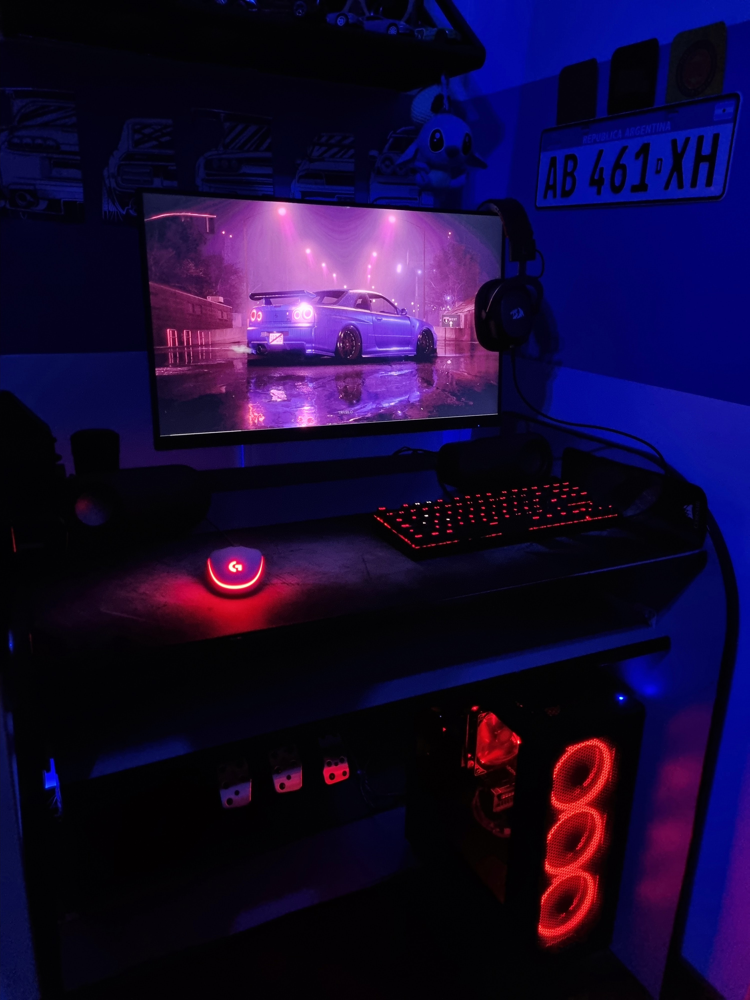

# Programación con objetos I: Mi presentación

Hola soy Franco Colombano, tengo 20 años y vivo en Hurlingham. Estudié en una escuela técnica donde recibí título de Técnico Electrónico. Entre las cosas que me enseñaron, aprendí a programar en ArduinoIDE, C y C++. Me di cuenta que me interesaba la programación y al terminar el secundario decidí anotarme en la UnaHur. Actualmente estoy cursando el segundo año de Tecnicatura en Programación. Mas adelante tengo pensado seguir con la licenciatura en Informática.

## Mis gustos / hobbies :boy:
* Videojuegos 
* Series / Películas
* Música
* Armado de PC Gamer 

### Para agregar una foto dejo una del rinconcito de mi cueva :nerd_face: 

